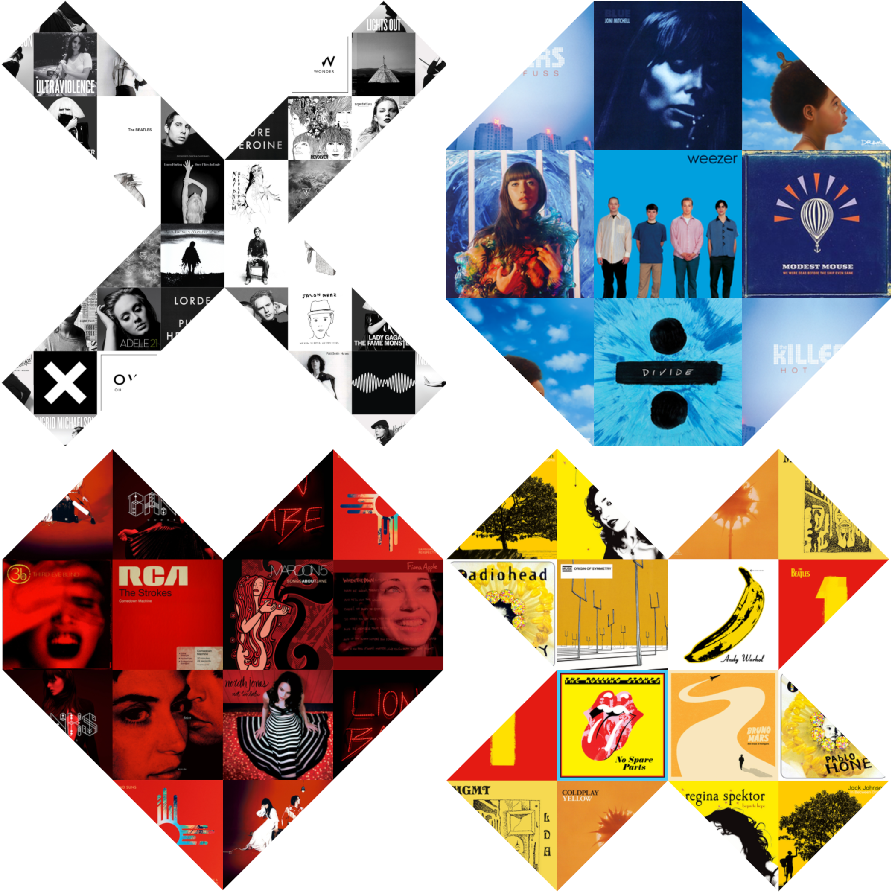

# Album Collage

## Overview
Album Collage is a tool for generating beautiful collages of album covers. Simply choose your favorite albums and select a collage shape to create a visualization of musical art!

**Live link**: https://d8y3e2oie7fh5.cloudfront.net/



## Features
* Select any artist and album available in the Last.fm database
* Select up to 30 albums
* Drag-and-drop in selection box to re-order album selections
* Choose between collage shapes dynamically generated for each possible number of album covers
* All collage shapes use the entirety of each album cover, segmented into at most 4 pieces, with no rotations
* Edit, shuffle, reset, and delete collages

## Running

**Live**:

https://d8y3e2oie7fh5.cloudfront.net/

**Locally**:
1. Clone or download this project from GitHub
2. ```cd``` into the project directory
3. Run ```npm install``` from the command line to install dependencies
4. Run ```npm start``` to launch in your browser of choice

## Dependencies

This project was built using Create-React-App.

* React
* React-DOM
* Babel
* Webpack
* ESLint
* SCSS
* Axios
